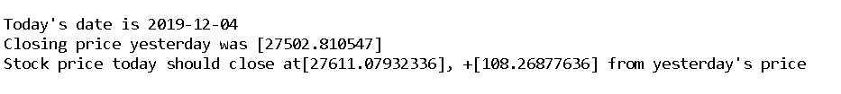

StockMovementPrediction
============================================

A predictive model that predicts the behavior of stocks of Dow Jones Index for a particular day given the historic data upto previous day. This model also leverages the power of Sentiment Analysis applied on Top News Headlines for each day to derive public sentiment- Positive, Negative or Neutral.

### Requirements

The model is built in an Anaconda Environment (Spyder) and Python 3.5.0. All the libraries which need to be downloaded are mentioned in requirements.txt.
	

### Dataset Description

The project makes use of 4 csv files namely:

1. data_old.csv - contains Top 25 news headlines for the days, stock exchange was operating in the year **(2008-2016)** along with actual sentiment of the day, downloaded from [here](https://www.kaggle.com/aaron7sun/stocknews#RedditNews.csv )

2. dji.csv - Stock data of DJI containing 7 base variables for the year **(2008-2016)** downloaded from **Yahoo Finance** website

3. combinednew.csv -  **Reddit** website is crawled from [here](https://www.reddit.com/r/usanews/ ) using **psaw** API to get news headlines which are then merged together to form a single agglomeration of news headlines for the year **(2017-2019)**

4. livestockdata.csv - Stock data of DJI containing 7 base variables for the year **(2016-2019)** downloaded from **Yahoo Finance** website
	

### Installation + Usage
- Install Python3 or above using Anaconda or any other method
- Install the requirements using pip install -r requirements.txt in Anaconda Prompt
- Clone this repo to your local machine
- Extract the zip file you downloaded
- Open a Python editor like Spyder 
	* You may create and use a virtual environment to work on this project
- Set the working directory to the folder where you extracted the files
- Since the whole project is divided into 3 files, you need to set the path for all the files in order to execute them simultaneously
	* In Spyder, Go to Tools-> PYTHONPATH manager-> Add PATH-> Browse to the folder containing python files
- Execute sentiment.py
- Execute regression.py
- Execute validate.py
	* validate.py contains logic to extract news data from Reddit and create csv files corresponding to everyday news headlines. Total of 1094 csv files will be generated in the working directory. You can either merge all the csv files into one and use it or you can directly use the csv file provided in the dataset named as "combinednew.csv"

### Pipeline
The pipeline followed in the project is as follows:
- Data Collection : Data extracted from the sources mentioned above in dataset headline
-  Natural Language Processing on news headlines
	* Data Processing
	* Bag of Words Model
	* TF-IDF Vectorization
	* Classification Algorithm implementation
- Data Pre-Processing & EDA on Stock Data
- Creation of Derived variables & Data Visualization
- Feature Selection & Feature Engineering
- Regression Model Building
- Model validation

### Results

1. **37** new variables were created that contributed to the model performance
2. XG Boost predicted sentiments with **85.6%** accuracy
3. Multiple Linear Regression with Backward Elimination  resulted in **11** most important columns  and **93%** R2 Score
4. Model verified on 2017-2019 data led to **0.83** R2 score
5. Model results on a random data point is given below

